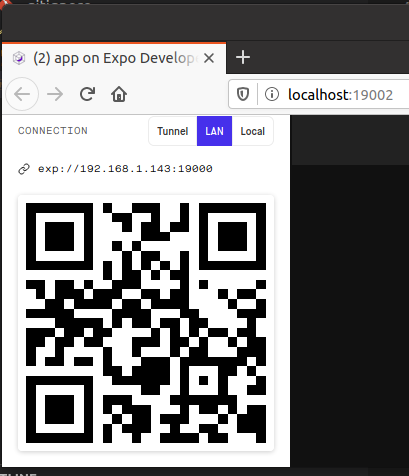
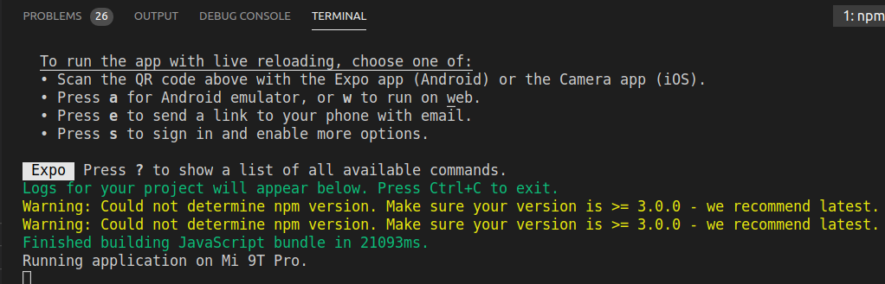

# projeto-pne

Pé na estrada : Informação das estradas na paula da sua mão

## stack tecnologico

prototipo: balsamiq wireframes
mobile: react-native
backend: docker + dotnetcore 3.1 + postgresql
editor: vscode
so: ubuntu

## requisitos

- docker
- docker-compose
- nodejs 12

## como executar

1. na pasta raiz do projeto rodar o seguinte comando.

    ```bash
    docker-compose up --build
    ```

2. Apos a inicialização do projeto, acessar a url do ranking PX, para garantir que a api esta funcional

    [ranking-px](http://localhost:8080/ranking-px)

3. dentro da pasta "./app" , executar os seguintes comandos:

    ```bash
    # install expo global
    sudo npm install -g --unsafe-perm expo-cli
    # entrar na pasta do app
    cd app
    # instalar dependencias
    npm install
    #executar o app
    npm start
    ```

4. instalar o expo no seu celular

    [expo-android](https://play.google.com/store/apps/details?id=host.exp.exponent&hl=en)

    [expo-ios](https://apps.apple.com/br/app/expo-client/id982107779)

5. escanear o qrcode do expo e rodar o app

    

    

    

